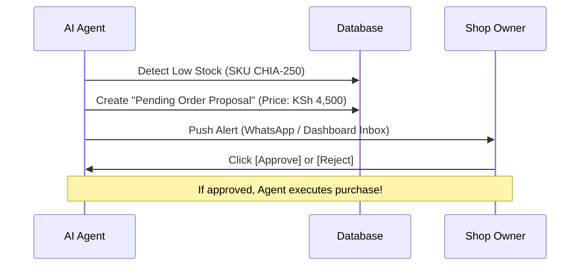

# Specification: AI Agent Operability & Sandboxing Protocol

This document outlines the architectural standard to make the platform natively operatable by autonomous AI agents, create isolated "Per-Shop Agents", and establish a secure bilateral communication channel with shop owners.

---

## 🤖 1. Making the Platform Operatable by AI Agents
To allow external AI agents (like Computer-Use models, custom LangChain runtimes, or browser automation assistants) to natively operate the website, we implement **Semantic Target Hooks**:

### A. Agentic UX DOM Attributes (`data-agent` properties)
We add standardized, machine-readable HTML attributes to interactive dashboard elements:
```html
<button data-agent-id="create-product-btn" aria-label="Create Product">
<input data-agent-id="search-orders-input" aria-label="Search Orders">
```
This ensures that any LLM browser agent scanning the page can instantly locate and click/type exactly what it needs without getting confused by layout changes or CSS class name variations.

### B. Unified Agent OpenAPI / JSON-LD Schema
We host a standardized public endpoint at `/well-known/ai-agent-schema.json`.
- When an agent enters the shop, it reads this schema (written in standard OpenAPI format).
- The schema tells the agent exactly what tools, REST APIs, or actions are available to it on that shop, allowing it to bypass the UI entirely and make direct, ultra-fast structural calls!

---

## 🔒 2. How to Create & Isolate "Per-Shop Agents"
To ensure that each shop has its own dedicated agent that is strictly sandboxed from other shops, we use database-level isolation:

### A. Supabase RLS & Dedicated API Keys
Each per-shop agent receives a specialized API key with a role restricted strictly to its associated `shop_id` in the `shop_members` table. Supabase Row-Level Security (RLS) guarantees that the agent can only read or edit resources matching its authorized `shop_id`.

### B. Persistent Agent Memory
We define a `shop_agent_memory` database table. This acts as the agent's "brain" between sessions. It stores context, task summaries, and learned merchant preferences in a `JSONB` memory payload so it never forgets its history.

---

## 💬 3. How the AI Agent Communicates with Its Owner
To keep operations secure and give the shop owner complete control over their agent's actions, we implement a **Human-in-the-Loop Approval Protocol**:



### A. Human-in-the-Loop (HITL) Approval Gates
For sensitive or financial tasks (e.g., updating prices, placing stock orders with suppliers, paying payouts, or launching ad campaigns), the agent is **never** allowed to execute the action directly. Instead, it creates a `"Pending Approval"` record in the database.

### B. Asynchronous Alerts
The agent pushes an alert to the owner via WhatsApp, SMS, or a dedicated **Agent Hub Inbox** in the owner's dashboard.

### C. Owner Command Console
A sleek, interactive chat-like terminal inside the owner's dashboard where the owner can converse directly with their shop agent (e.g., *"Amoit, run a sales analysis for last week and draft a discount coupon for returning buyers"*). The agent returns the draft, and the owner can approve or modify it with one click!
