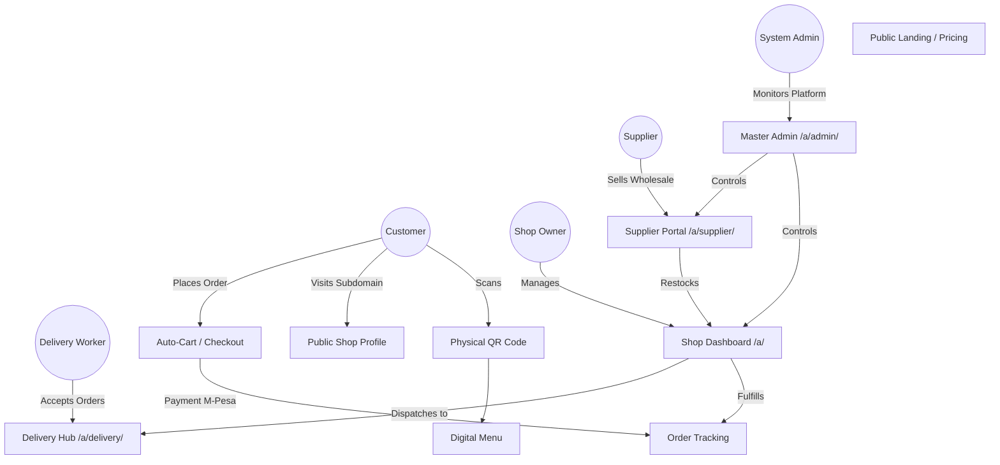

# Modern Savannah — System Sitemap & Role Flow

This document maps out the entire system architecture in terms of User Roles, System Entities, and Routing. It serves as a master index for how users move through the application.

---

## 1. Core Entities

- **Customer / Guest**: End-users who scan QR codes, browse menus, and place orders. They don't need a strict account; they are authenticated implicitly via QR Sessions or local storage (`customer_history`).
- **Shop / Merchant**: The business entity. Has products, orders, QR codes, and appearance settings.
- **Shop Owner / Manager (`owner`, `manager`)**: The admin for a specific shop. Has access to the Dashboard (`/a/*`) to manage their specific shop's operations.
- **Supplier (B2B)**: Wholesale distributors who provide products to Retail Shops via the `SupplierPortal`.
- **Delivery Worker (`delivery_worker`)**: Riders/drivers who log into the Delivery Hub to pick up and fulfill orders.
- **System Admin (`system_admin`)**: You (the platform owner). Has absolute access to the `MasterAdmin` dashboard to manage billing, cross-shop analytics, and global operations.

---

## 2. High-Level Flow Diagram

---

## 3. Comprehensive Route Map

### 🟢 Public & Marketing Routes (No Auth Required)
These routes are the face of the platform.
- `/` — Platform Home
- `/pricing` — Platform Pricing
- `/login`, `/signup` — Authentication entry points
- `/s/:shopId` — Public Shop Profile (also resolves via custom subdomains like `mamasy.modernsavannah.com`)
- `/product/:productId` — Public Product Details
- `/request-access` — Waitlist / Contact
- `/join/distribution-network` — B2B Supplier Signup

### 🟡 Customer / Guest Routes (Session Implicit Auth)
These routes are gated by `QrAccessGuard`. A customer must have scanned a QR code or visited a shop link to access these.
- `/menu` — The main shopping interface for a specific shop
- `/cart` — Checkout flow (integrates with `PaymentModal` / M-Pesa)
- `/order` — Order Success page
- `/track/:orderId` — Live Order Tracking
- `/campaign` — Campaign/Discount Landing Page

### 🟣 Shop Dashboard Routes (Requires `owner` or `manager` Auth)
These routes are protected by `AuthGate` and nested under `/a/`.
- `/a` — Main Dashboard (Sales Overview, Quick Stats)
- `/a/orders` — Live Orders Manager (Kanban board for fulfillment)
- `/a/products` — Product & Inventory Manager
- `/a/qrs` — QR Code & Table Generator
- `/a/marketing` — Marketing Studio (WhatsApp Ads, Store Appearance)
- `/a/finances` — Accounting Hub (Revenue, Payouts)
- `/a/sales-brain` — AI Sales Assistant Settings
- `/a/settings` — General Shop Settings & Billing

### 🔵 Specialized Portals
- **Delivery Hub**
  - `/a/delivery` — Delivery Portal Entry
  - `/a/delivery/worker` — Console for Riders (Accepting/Updating drops)
  - `/a/delivery/manager` — Fleet Management (Monitoring active riders)
- **Supplier Hub**
  - `/a/supplier` — B2B Wholesale Portal (Managing catalog for retailers)

### 🔴 Master Admin Routes (Requires `system_admin` Auth)
These routes are strictly locked down to the platform owner.
- `/a/admin` — Master Admin Overview (Platform Revenue, Global Stats)
- `/a/admin/shops` — All Registered Shops (Suspend/View)
- `/a/admin/plans` — Global Subscription Tiers
- `/a/admin/global-orders` — All Orders across the platform
- `/a/admin/payouts` — M-Pesa automated vendor payouts
- `/a/admin/engineering` — Developer & Edge Function monitors

---

## 4. State & Context Architecture

To ensure the UI is fast and independent, the application uses several layered contexts:
1. **`auth-service.js`**: Persists the logged-in User (`owner`/`manager`) to `localStorage`.
2. **`qr-session.js`**: Tracks the current Shop Context for *Customers*. When a user scans a table QR, their `shop_id` and `table_no` are locked in session storage so they don't have to keep selecting the shop.
3. **`cart-store.js`**: Persists the customer's cart locally until they checkout.
4. **`App.jsx` (Subdomain Resolution)**: Automatically detects if the app is loaded on a subdomain (e.g., `burgerjoint.app.com`) and forces the routing into that shop's specific Public Profile.
