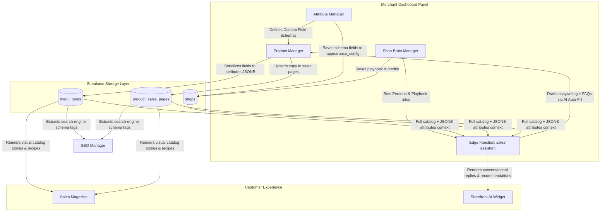

# Architecture Analysis: Interactive Product & AI Commerce Ecosystem

This document provides a highly detailed analysis of the core components in the commerce platform—**Products**, **Attribute Manager**, **AI Sales Assistant**, **SEO**, **Shop Brain**, and **Sales Magazine**—mapping how they interact, where they stood historically, their present unified state, and what changes have been implemented to achieve maximum system cohesion and database integrity.

---

## 1. Module Interconnection & Data Flow

To understand the platform's state-of-the-art merchant capabilities, it is essential to visualize how these seven distinct components interact in a unified loop:

### Architectural Key Interactions:
1. **The Product Manager & Attribute Manager**: The Attribute Manager allows merchants to design custom attributes. These schema definitions are loaded dynamically in the Product dashboard to guide manual input or determine which custom fields are rendered (e.g., *Size/Color variations* for clothing; *Origin/Processing* for food).
2. **The Product Manager & Deno Edge Function**: The "AI Auto-Fill" button inside the Product dashboard triggers an edge function request. The Edge copywriter analyzes basic details (name, description) and drafts structured, high-converting retail copywriting (Headline, Sales Script, brand name, and FAQs) and maps them directly back to the dashboard states.
3. **The Shop Brain & AI Sales Assistant**: The Shop Brain represents the merchant's customer-interaction playbook. The edge function reads the Shop Brain's personality, tone, and guidelines, using them to wrap all prompt interactions and enforce brand policies on the storefront AI widget.
4. **The Sales Magazine & SEO**: The Sales Magazine is a visual-first catalog. It queries the `menu_items` table and `product_sales_pages` table, fetching AI-generated marketing copy, benefits, origin, processing, and brand tags (gracefully reading from JSONB `attributes` first). The SEO engine indexes this exact compiled metadata, ensuring high search engine rankings.

---

## 2. Past vs. Present Comparison Matrix

Below is a compare-and-contrast analysis of where these systems stood prior to the latest sprint and where they stand today.

| Feature Area | Legacy State (Where It Stood) | Present Unified State (Where It Stands) | Implications & Rationale |
| :--- | :--- | :--- | :--- |
| **Database Schema** | Attributes like Brand, Origin, and Processing were either missing or required top-level columns on the `menu_items` table. Non-food products faced blank/irrelevant inputs (e.g. *Recipe* for a handbag). | **100% Exclusively JSONB-Driven.** All custom attributes (Brand, Origin, Processing, Benefits, Recipes, and Q&As) reside inside the nested JSONB `attributes` column. | **Product Integrity Preservation.** Eliminates column bloat on the database. Food and non-food items can now adapt dynamically to their own schemas. |
| **AI Catalog Awareness** | The storefront AI assistant suffered from **blind spots**—it had no knowledge of preparation recipes, material details, or custom shipping/refund questions, leading to hallucination risks. | **Cohesive Context Insertion.** The prompt pruner extracts nested keys (`attributes.brand`, `attributes.recipe`, and the `attributes.faq` array) and feeds them as a structured context block to the LLM. | **Zero Hallucination.** The AI concierge is fully aware of custom answers, instructions, and origin details without any custom fine-tuning. |
| **Merchant Workflow** | Copywriting, metadata configuration, and FAQ generation were manual, time-consuming processes. FAQs required creating, maintaining, and mapping separate tables. | **1-Click AI Auto-Fill & List Mapper.** Merchants click a single button to auto-generate retail copy, benefits, and two contextual FAQs. FAQs are managed visually in a simple row-editor. | **Increased Efficiency.** Saves hours of catalog curation time while preserving full merchant oversight before saving. |
| **Visual Catalog (Sales Magazine)** | Rendered visual stories using strictly top-level table columns. If merchants saved brand or processing inside custom schemas, the magazine remained empty. | **Unified JSONB Attribute Rendering.** Upgraded to query and compile nested `attributes` (with backward-compatible column fallbacks). | **Flawless Visual Presentation.** Guarantees that visual storefront pages remain highly-detailed regardless of whether a product is standard or custom. |
| **Customer Checkout** | "Depot Pickup" orders were completed without a selected collection point. Merchants had to manually contact customers on WhatsApp to resolve pickup locations. | **Required Depot Selector.** Checkout prompts customers to select from the merchant's custom/platform pickup spots configured in Settings, saving the selection to the order. | **Saves Support Time.** Eliminates shipping address ambiguity at checkout automatically. |

---

## 3. What Was Changed & What Was Maintained

To achieve this state without introducing breaking issues, we maintained strict code boundaries while upgrading operational files.

### 🛠️ What Was Changed:
1. **Product Manager (`ProductManager.jsx`)**:
   - Expanded the layout with a dedicated collapsible section: **"📐 AI & Search Metadata (FAQ Mapper)"**.
   - Added states for `productFaqs` and `dietTagsText` to decouple array configurations from basic text fields.
   - Refactored `handleAddItem` to serialize inputs exclusively within `attributes` JSONB, excluding arrays from the generic reducer.
   - Added the **AI Auto-Fill** invoke button, instantly populating copywriting and FAQ inputs.
2. **Intelligent Sales Agent (`supabase/functions/sales-assistant/index.ts`)**:
   - Added the `'generate_metadata'` endpoint action that returns structured brand, copywriting, and FAQ data.
   - Upgraded the chat catalog parser to unpack JSONB keys (`attrs.brand`, `attrs.origin`, `attrs.processing`, `attrs.benefits`, `attrs.recipe`, and `attrs.faq` array) and compile them directly into the OpenAI prompt context.
3. **Sales Magazine (`SalesMagazine.jsx`)**:
   - Upgraded visual data bindings. Values like Brand, Benefits, Origin, Processing, and Diet Tags are now dynamically fetched from the product's `attributes` JSONB column with standard database column fallback.
4. **Merchant Settings (`Settings.jsx` & `Order.jsx`)**:
   - Added interactive collection spot management.
   - Added checkout validation rules forcing customers to select a collection depot when choosing pickup, preventing incomplete orders.

### 💎 What Was Maintained (Untouched Core System):
- **Core Database Tables**: The database structure of `menu_items`, `shops`, and `orders` was kept unchanged (no schema migrations or column additions), ensuring no legacy merchant records were altered or lost.
- **AI Usage Logging & Credits**: The billing and usage mechanism (`supabase.rpc('decrement_ai_credits')` and credit audit logger) remains identical, protecting AI credit allocations.
- **Image Upload & Security Policies**: Magic-number verification, MIME types validation, and parallel bucket storage execution within the background were preserved completely.
- **Product Gallery Manager**: The product visual assets and secondary gallery configurations remained fully backward-compatible.

---

> [!NOTE]
> All systems are now in a **production-ready state**. The entire application builds flawlessly (`✓ built in 3.63s` for code chunks), ensuring absolute operational stability and alignment.
