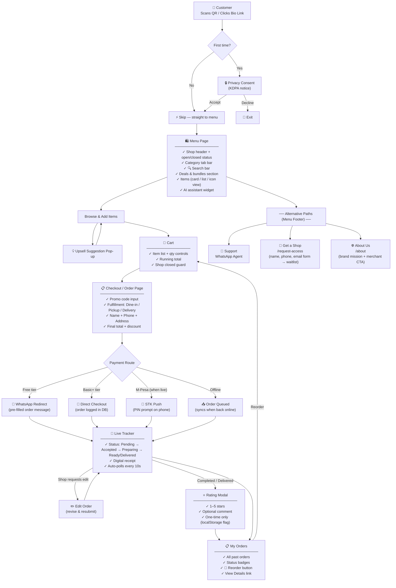

# qRshop Customer Storyboard

## Full Journey Map



---

## Alternative Paths Detail

| Path | Entry Point | Page | What It Does |
|---|---|---|---|
| **Support** | Menu footer | WhatsApp deep link | Opens pre-filled WhatsApp chat with platform support number |
| **Get a Shop** | Menu footer | `/request-access` | Waitlist form → name, phone, email → saves to `onboarding_requests` → team reaches out on WhatsApp |
| **About Us** | Menu footer | `/about` | Brand story + "Apply for Merchant Access" CTA |
| **Contact** | Platform nav | `/contact` | WhatsApp support link + email + physical node locations |

> [!NOTE]
> All 3 alternative paths are accessible from the **Menu footer** — visible to every customer at the bottom of the shop menu page. They are passive paths — the customer must scroll to the footer to find them.

---

## State Transitions (Order Lifecycle)

```
pending → pending_payment → paid → preparing → ready → completed
                                                      ↘ delivered
       ↘ requires_edit (customer edits) ──────────────↗
       ↘ rejected → edit flow
       ↘ archived / cancelled
```

---

## Customer Data Captured

| Data | When | Where Stored |
|---|---|---|
| Name | Checkout modal | `orders.customer_name` + localStorage |
| Phone | Checkout modal (Basic+ only) | `orders.customer_phone` + localStorage |
| Email | Checkout modal | `orders.customer_email` |
| Order history | After first checkout | localStorage + `orders` table |
| Rating | Post-completion | `order_ratings` table |
| Privacy consent | First scan | localStorage |
