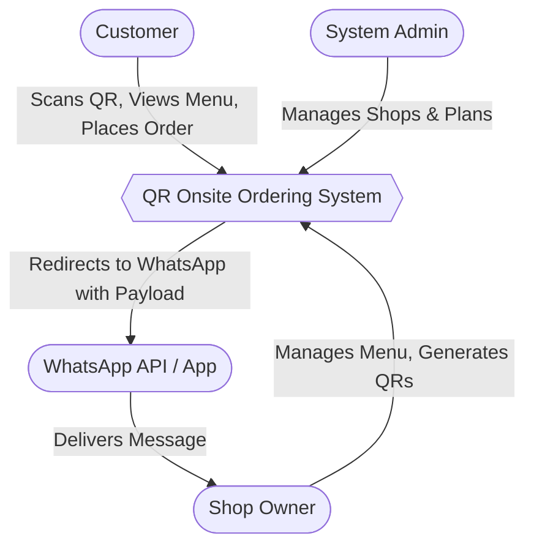

# Structure Charts

## 1. Context Diagram (Level 0)



## 2. Level 1 Data Flow Diagram (DFD)

```mermaid
flowchart LR
    Customer([Customer])
    Owner([Shop Owner])
    
    Sub1((1.0
QR Session
Management))
    Sub2((2.0
Cart & Order
Processing))
    Sub3((3.0
Menu
Management))
    
    DB[(Database)]
    
    Customer -->|URL Params| Sub1
    Sub1 -->|Valid Session| Sub2
    
    Customer -->|Selects Items| Sub2
    Sub2 -->|Reads Prices/Upsells| DB
    
    Owner -->|Creates/Edits| Sub3
    Sub3 -->|Writes Data| DB
```\n