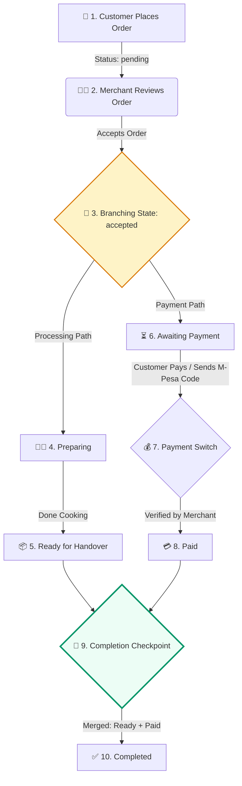
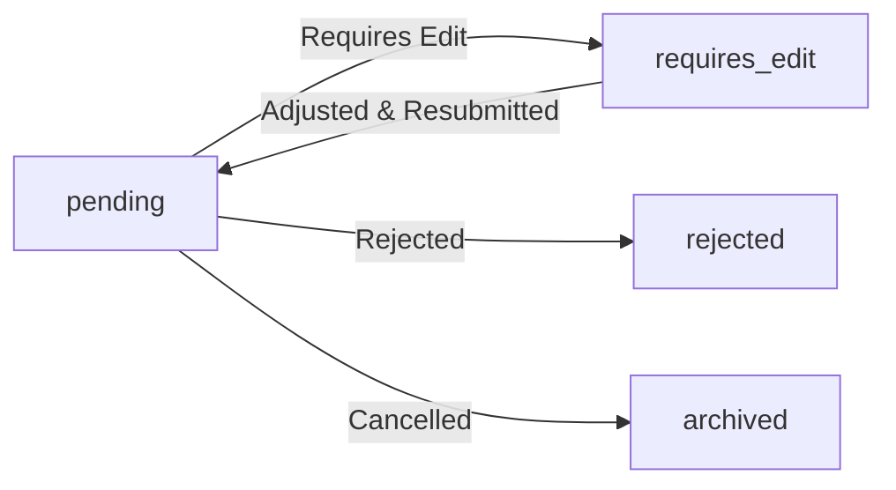

# Order Lifecycle & Parallel State Graph

Below is the visual map of the order's lifecycle. It illustrates how the order branches into **Processing** and **Payment** parallel paths at the `Accepted` state, and how both paths must merge and resolve before transitioning to `Completed`.

## Lifecycle State Diagram

---

## 🚦 Parallel Paths Rules & State Switch Behavior

### 1. Processing Branch (`Accepted` ➡️ `Preparing` ➡️ `Ready`)
* **`accepted`**: The merchant accepts the order, kicking off the two parallel branches.
* **`preparing`**: The item is in the kitchen or the prep desk. 
* **`ready`**: The items are ready to be picked up or delivered to the table. **The order stays in this state until it's also paid.**

### 2. Payment Branch (`Accepted` ➡️ `Awaiting Payment` ➡️ `Paid`)
* **`pending_payment` / `stk_pushed`**: The payment switch is currently `unpaid`. The merchant has asked for payment, and the customer has been given the payment instructions or the M-Pesa till.
* **`paid`**: The payment switch is flipped to `paid` by the merchant (or upon successful transaction code verification).

### 3. The Completion Checkpoint
To advance the order to **`completed`**, the system expects a **merge** of both states:
$$\text{Order State} = \text{Ready} \quad \text{AND} \quad \text{Payment Switch} = \text{Paid}$$

> [!IMPORTANT]
> If a merchant attempts to mark an order as `Completed` without the `Paid` switch flipped, the system blocks the transition to prevent unpaid orders from being closed out!

---

## 🗺️ Extended System Edge Cases

